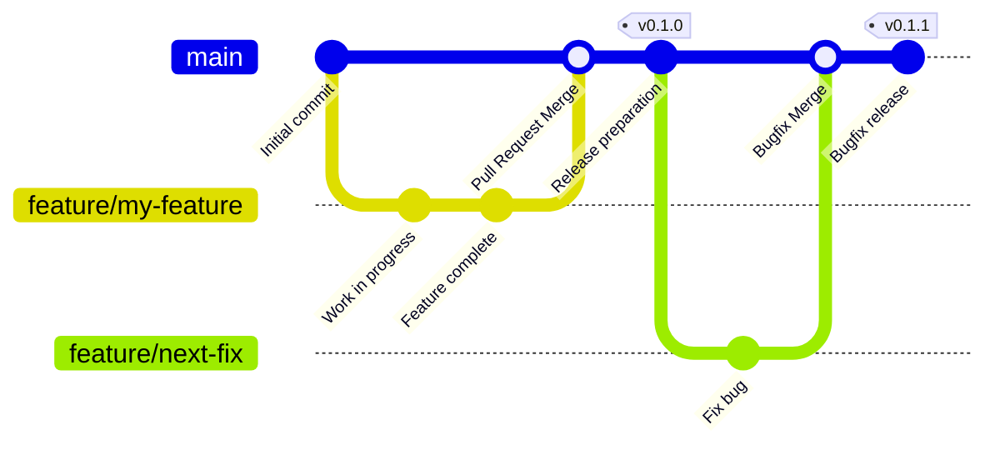

## Github Flow

### Release Process
1. Push your changes to `main`.
2. Create a new **Release** on GitHub.
3. Use a semantic version tag (e.g., `v1.2.3`).
4. Publishing the release will trigger the `release` workflow which builds native libraries and publishes to GitHub Packages.